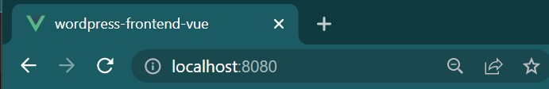

# Examination in CMS


## Getting started

For this project you need to have a WordPress.com website. 

### Built With

This project is built with 


### Installation
Depending on if you want to deploy on your own you need to fork this repository, if not then you can just clone it.

1. Clone this repository to start with.
   ```bash
   git clone https://github.com/IzaMarkstrom/wordpress-frontend-vue.git
   ```
2. Install NPM packages
   ```bash
   npm install
   ```
3. Create an .env file with variable name ????
   ```bash
   pip install foobar
   ```

4. To create new posts to the WordPress backend, send your username or email address to:

   * markstrom93@hotmail.com

## Run 
To start this project you have to run
   ```bash
   npm run serve
   ```



## Deploy
This project is deployed in Vercel [here](https://wordpress-frontend-vue.vercel.app/)

## Deploy on your own
You need to have forked the project for this step.

1. Go to [vercel](https://vercel.com/dashboard) and create an account/ log in.
2. Add new - project
3. Connect GitHub till Vercel 
4. Import your repository
5. Add environmental variables (same as in your .env file)

## Usage

```python
import foobar

# returns 'words'
foobar.pluralize('word')

# returns 'geese'
foobar.pluralize('goose')

# returns 'phenomenon'
foobar.singularize('phenomena')
```


## Contact
Administrator: Iza Markström

Github: [IzaMarkstrom](https://github.com/IzaMarkstrom)